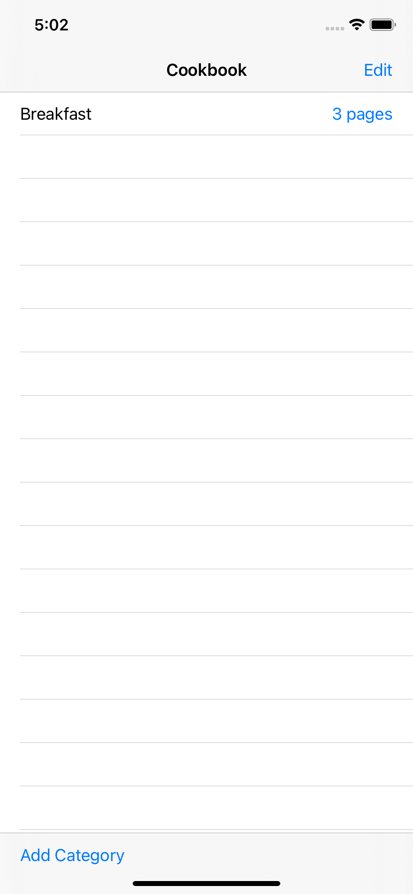
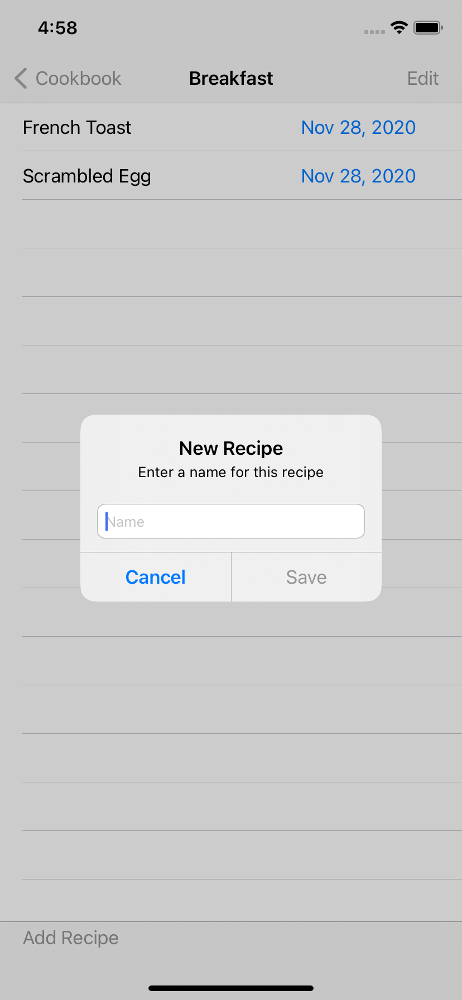
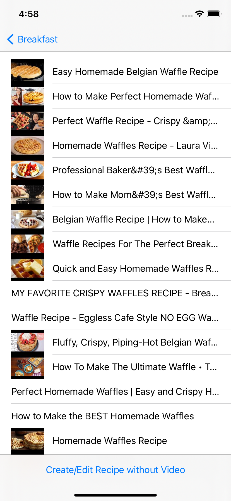
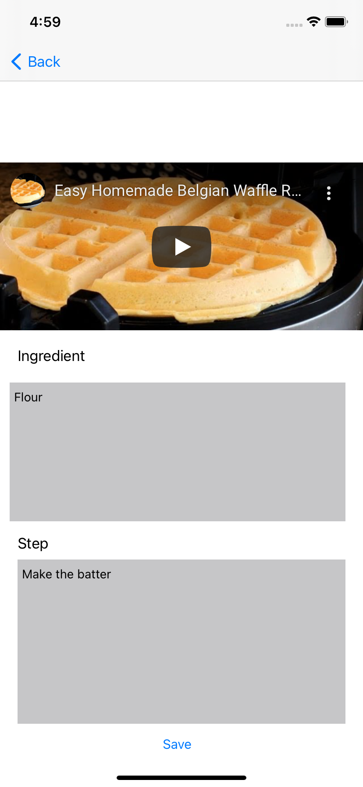
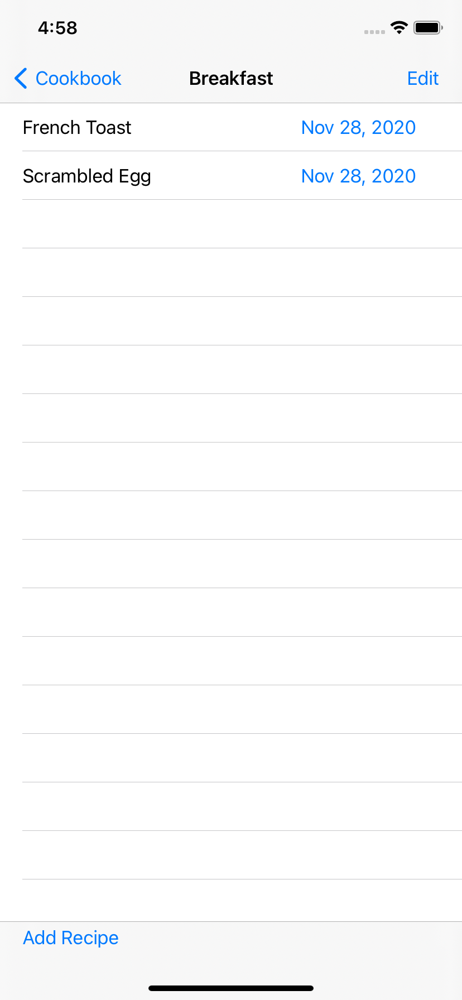

#  Cookbook

## Overview

Categorize and save your recipes

## Requirements

iOS version: 14.2
XCode version: 12.2
Swift version: 5

## Dependency

Google API Key for Youtube Data API

## Installation

1. Open ios-cookbook.xcodeproj with Xcode
2. Select iOS simulator or attach your device (Recommended: iPhone 11 or higher)
3. Click run button

## Usage

### Create a recipe
1. Open the app
2. Click an existing Category or create a new category by clicking **Add Category** button at the bottom

3. Click **Add Recipe** button at the bottom and enter the name of the recipe

4. Either click one of the youtube video in the search list or click **Create/Edit Recipe without Video** button

5. Enter **Ingredient** and **Step** in the respective text box

6. Click **Save**

### View a recipe
1. Open the app
2. Click on an existing category 
3. Click on an existing recipe

4. To edit a recipe, click **Edit** button

